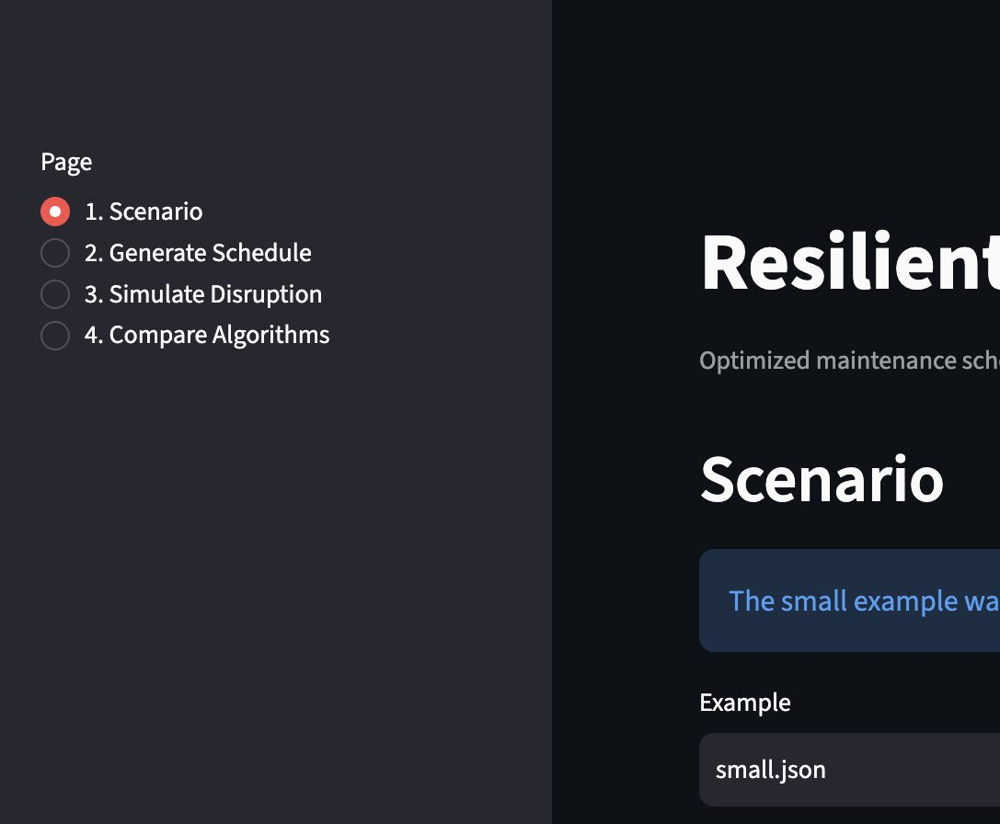
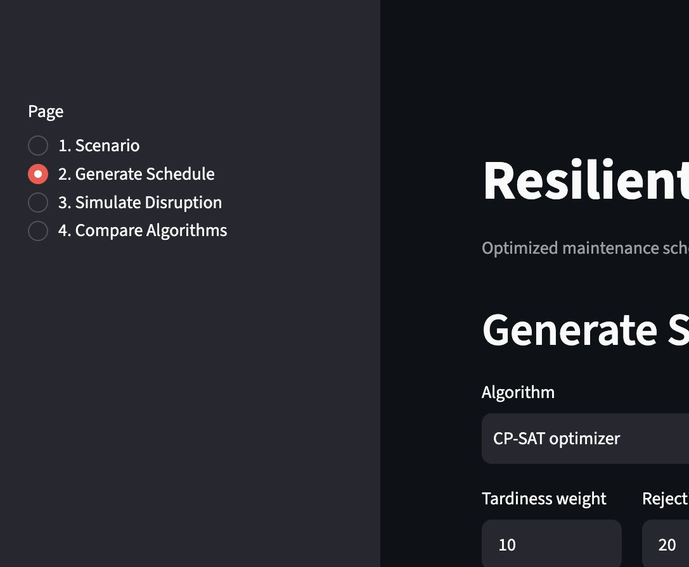
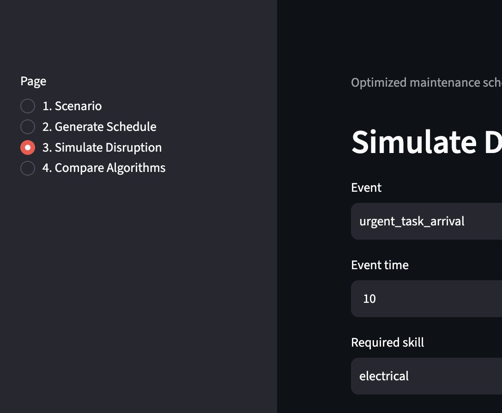
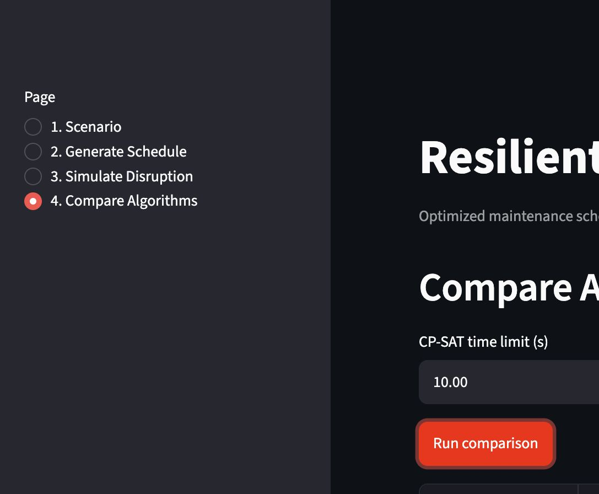

# ResilientOps

[](https://github.com/b2ty9t7yhz-source/ResilientOps/actions/workflows/ci.yml)


ResilientOps is a smart scheduling system that assigns tasks to limited workers and machines. When an urgent task arrives, a worker becomes unavailable, or a machine breaks down, the system automatically repairs the remaining schedule.

It is a complete Python portfolio project: typed JSON inputs, three greedy baselines, a Google OR-Tools CP-SAT optimizer, disruption-aware re-optimization, shared metrics, Plotly charts, a Streamlit dashboard, a FastAPI service, a CLI, tests, Docker, and CI.

The dashboard also explains why tasks moved, became late, or were rejected; supports direct table editing; exports CSV and JSON; and marks event, outage, and soft frozen-horizon regions on repair charts.

## The business problem

A maintenance team must complete repair jobs with limited technicians and equipment. Technicians have different skills, machines have working hours, and some jobs cannot begin until other jobs finish. ResilientOps turns those constraints into a feasible schedule and balances deadline performance, task value, and makespan.

For example, an electrical panel diagnosis may require an electrical technician and a diagnostic cart. A wiring repair can depend on that diagnosis. If the lift breaks at time 10, work already completed or running stays fixed while future lift jobs are reassigned or delayed.

## Architecture


The `src/resilient_ops` package holds all business logic. The CLI, API, and dashboard call the same schedulers and evaluator; no scheduling logic is duplicated in interface code.

## Scheduling model

Hard constraints ensure that:

- mandatory tasks are scheduled and optional tasks can be rejected;
- assignments use qualified workers and compatible machines;
- workers and machines never overlap;
- release times, dependencies, and resource availability are respected;
- completed and in-progress assignments remain fixed during repair.

The CP-SAT objective minimizes:

```text
10 × priority-weighted tardiness
+ 20 × rejected task value
+ 5 × schedule-change cost
+ 1 × makespan
```

All weights are configuration fields. Change cost covers start movement, worker changes, machine changes, and rejection of a previously accepted task. Tasks inside a configurable frozen horizon receive a stronger soft stability penalty.

Repair models are warm-started from the previous schedule. CP-SAT responses include the objective value, best objective bound, and relative optimality gap so users can distinguish a proven optimum from a time-limited feasible result.

## Algorithms

- **Earliest Deadline First (EDF):** schedules the dependency-ready task with the earliest deadline.
- **Highest Priority First:** schedules the dependency-ready task with the greatest priority.
- **Minimum Slack First:** minimizes `deadline - current time - duration`.
- **CP-SAT:** jointly optimizes task acceptance, timing, workers, and machines using optional interval variables.

The baselines use deterministic serial schedule generation and never intentionally return an invalid schedule. Every result is scored by the same evaluator.

## Disruption workflow

The repair engine accepts `urgent_task_arrival`, `worker_unavailable`, and `machine_breakdown` events. It advances to the latest event time, labels finished work `completed`, labels already-started work `in_progress`, locks both groups, applies resource outages, and re-optimizes the rest against the original schedule.

Assumption: if a worker absence or machine outage begins after a task has started, that task may finish on its original resource. This models a safe completion or handover decision already made by operations. Future assignments must respect the outage.

## Quick start

Python 3.12 is required.

```bash
make install
source .venv/bin/activate

resilient-ops validate data/examples/small.json
resilient-ops solve data/examples/small.json --solver cp-sat
resilient-ops compare data/examples/medium.json
resilient-ops repair data/examples/disruption.json
```

Common development commands are available through the Makefile:

```bash
make quality      # Ruff and mypy
make test         # pytest with coverage
make smoke        # examples + solver + repair + API
make benchmark    # 8/25/50-task comparison
make dashboard
make api
make lock         # refresh requirements.lock
```

Start the interfaces:

```bash
resilient-ops api
# Open http://localhost:8000/docs

resilient-ops dashboard
# Open http://localhost:8501
```

## API examples

The service exposes `GET /health` plus `POST /validate`, `/solve`, `/repair`, and `/compare`. Interactive OpenAPI documentation is available at `/docs`.

Every response includes an `X-Request-ID` correlation header. Supplying the same header in a request preserves it in the response, which makes API and structured JSON logs easier to trace.

```bash
curl http://localhost:8000/health

curl -X POST http://localhost:8000/solve \
  -H 'Content-Type: application/json' \
  -d @solve-request.json
```

The complete request schemas, including objective settings and discriminated disruption events, are shown in OpenAPI.

## Input data and synthetic generation

- `data/examples/small.json`: 8 tasks, 3 workers, 2 machines.
- `data/examples/medium.json`: 25 tasks, 6 workers, 4 machines.
- `data/examples/disruption.json`: scenario plus a breakdown and urgent arrival.
- `data/invalid/cyclic_dependencies.json`: intentionally invalid validation fixture.

Use `resilient_ops.generators.generate_scenario(...)` to make deterministic synthetic instances.

## Metrics and visualization

The shared evaluator reports weighted tardiness, late tasks, on-time rate, accepted and rejected value, worker and machine utilization, makespan, runtime, changed tasks, and total start movement. Gantt bars contain textual status and change labels, use patterns for execution status, and mark deadlines so the charts do not rely on color alone.

The Scenario page loads the small example automatically and exposes editable task, worker, and machine tables. Schedule pages provide CSV/JSON downloads and human-readable explanations. Repair charts label the event time, affected resource outage, and soft frozen horizon.

## Screenshots

### Editable scenario and validation



### Optimized schedule and exports



### Original versus repaired schedule



### Algorithm quality and runtime comparison



These screenshots are generated from the included small scenario and demonstrate:

1. Scenario validation and resource tables.
2. Optimized schedule Gantt chart and metrics.
3. Original-versus-repaired disruption view.
4. Algorithm quality/runtime comparison.

## Tests and code quality

```bash
ruff check .
mypy src
pytest
```

Tests cover validation, cycles, resource matching and overlap, precedence, deterministic baselines, objectives, infeasibility, all disruption types, locked assignments, and API endpoints.

Coverage is reported on every test run and enforced at a 75% minimum. `scripts/smoke.py` exercises complete user workflows, while `benchmarks/benchmark.py` produces comparable quality/runtime results for deterministic synthetic instances.

## Docker

```bash
docker build -t resilient-ops .
docker run --rm -p 8000:8000 resilient-ops
```

The image includes a `/health` Docker health check. CI runs Ruff, mypy, coverage-enforced tests, the end-to-end smoke script, a bounded benchmark, and a Docker build. Dependabot and pre-commit configuration are included.

The default container command runs FastAPI. Override it with `resilient-ops dashboard --server.address=0.0.0.0` only if extending the CLI to forward Streamlit options; locally, the documented dashboard command is recommended.

## Important assumptions

- Time is discrete and intervals are half-open: `[start, end)`.
- A task needs a worker only when `required_skill` is set, and a machine only when `required_machine_type` is set.
- Deadlines are soft objective targets; releases, dependencies, availability, and resource capacity are hard constraints.
- Optional successors cannot be accepted when a predecessor is rejected.
- CP-SAT uses one search worker by default for reproducible portfolio results.
- Repair applies a supplied batch of events, then locks work using the latest event time.

## Known limitations

- One worker and one machine at most per task; no crews or multi-machine jobs.
- No setup/travel times, shifts that change by date, persistence, authentication, or live execution feed.
- Repair is a batch re-optimization rather than a continuous event stream.
- The frozen horizon is a strong soft preference, not a guarantee.

## Future improvements

Natural extensions include setup and travel times, team assignments, recurring calendars, uncertainty simulation, database persistence, authenticated multi-user scenarios, and production observability. Advanced metaheuristics, stochastic optimization, and distributed queues are intentionally outside version 1.
